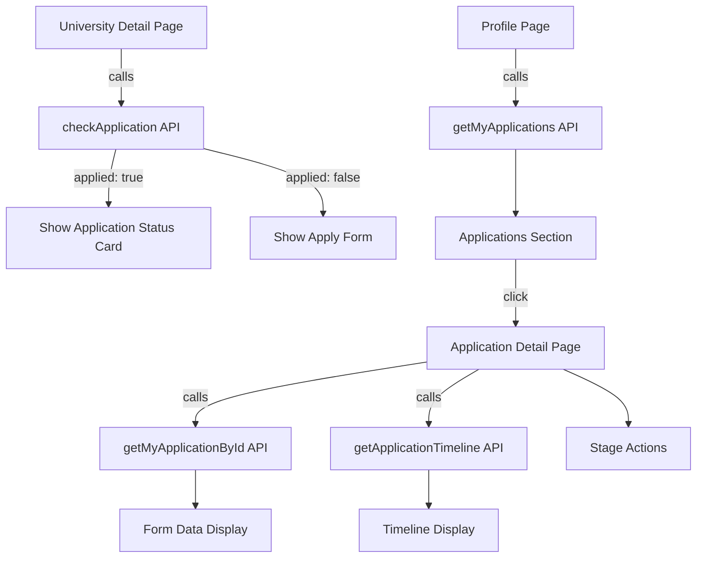

# Design Document: Student Application Integration

## Overview

This feature enhances the student application flow by:

1. Adding an "already applied" check on university detail pages
2. Showing submitted applications on the profile/dashboard page
3. Enriching the application detail page with full form data, timeline, and stage actions

The implementation leverages existing domain APIs (`student.api.ts`, `timeline.api.ts`) and adds a new `checkApplication` API call. All changes are frontend-only — the backend endpoints already exist.

## Architecture



## Components and Interfaces

### New API Functions

```typescript
// apps/web/domains/student/student.api.ts (addition)
export function checkApplication(universityId: string) {
  return client.get<ApplicationCheckResult>(
    `/student/applications/check/${universityId}`,
  );
}
```

### New Query Hook

```typescript
// apps/web/domains/student/student.queries.ts (addition)
export function useCheckApplication(universityId: string) {
  return useQuery({
    queryKey: [...queryKeys.student.applications(), "check", universityId],
    queryFn: () => checkApplication(universityId),
    enabled: !!universityId,
  });
}
```

### New Types

```typescript
// apps/web/domains/student/student.types.ts (addition)
export interface ApplicationCheckResult {
  applied: boolean;
  application?: {
    id: string;
    selectedProgram: string;
    status: string;
    submittedAt: string;
  };
}
```

### Modified Components

1. **University Detail Page** (`apps/web/app/(students)/student/university/[slug]/page.tsx`)
   - The `ApplicationForm` component wraps with a check: if already applied, show status card instead

2. **Profile Page** (`apps/web/app/(students)/student/profile/page.tsx`)
   - Add an "Applications" card section below the stage timeline showing submitted applications

3. **Application Detail Page** (`apps/web/app/(students)/student/applications/[id]/page.tsx`)
   - Expand to show full form data, timeline events, and stage-specific action buttons

### Stage Actions Mapping

```typescript
const stageActions: Record<
  number,
  { label: string; href: string; description: string }
> = {
  2: {
    label: "Pay Admission Fee",
    href: "/student/payments",
    description: "Pay ₹5,000 to proceed",
  },
  3: {
    label: "View Exam Details",
    href: "/student/exams",
    description: "Check exam schedule & pay ₹10,000",
  },
  4: {
    label: "View Invitation Letter",
    href: "/student/letters",
    description: "Download your invitation letter",
  },
  5: {
    label: "Visa Support",
    href: "/student/visa-support",
    description: "Get visa and travel assistance",
  },
};
```

## Data Models

### ApplicationCheckResult

| Field                       | Type              | Description                                    |
| --------------------------- | ----------------- | ---------------------------------------------- |
| applied                     | boolean           | Whether student has applied to this university |
| application                 | object (optional) | Existing application summary if applied        |
| application.id              | string            | Application UUID                               |
| application.selectedProgram | string            | Program chosen                                 |
| application.status          | string            | Current status (pending/approved/rejected)     |
| application.submittedAt     | string            | ISO date of submission                         |

### Timeline Event (existing)

| Field         | Type    | Description                       |
| ------------- | ------- | --------------------------------- |
| id            | string  | Event UUID                        |
| applicationId | string  | Related application               |
| stage         | number  | Stage number (1-5)                |
| event         | string  | Event type enum                   |
| title         | string  | Human-readable title              |
| description   | string  | Event description                 |
| occurredAt    | string  | ISO timestamp                     |
| isCompleted   | boolean | Whether event is done             |
| isActive      | boolean | Whether this is the current event |

## Correctness Properties

_A property is a characteristic or behavior that should hold true across all valid executions of a system — essentially, a formal statement about what the system should do. Properties serve as the bridge between human-readable specifications and machine-verifiable correctness guarantees._

### Property 1: Applied check determines UI state

_For any_ university ID and authentication state, if `checkApplication` returns `applied: true`, the university detail page must render the application status card and NOT render the apply form; if it returns `applied: false`, the page must render the apply form and NOT render the status card.
**Validates: Requirements 1.2, 1.3**

### Property 2: Applications on profile are sorted by date descending

_For any_ list of student applications, the profile page must display them in descending order of `submittedAt` date (most recent first).
**Validates: Requirements 2.4**

### Property 3: Application detail renders all form fields

_For any_ application with form data, the detail page must render every field present in the form data object (personal info, address, languages, program).
**Validates: Requirements 3.1**

### Property 4: Stage-to-action mapping is correct

_For any_ application with a current stage between 2 and 5, the detail page must display the correct action button corresponding to that stage's required next step.
**Validates: Requirements 3.3, 4.3**

### Property 5: Status badge color mapping

_For any_ valid application status string, the rendered badge must use the correct color scheme: pending→yellow, in_review→blue, approved→green, rejected→red.
**Validates: Requirements 4.1**

## Error Handling

| Scenario                          | Behavior                                                            |
| --------------------------------- | ------------------------------------------------------------------- |
| `checkApplication` API fails      | Fall back to showing the apply form (graceful degradation)          |
| `getMyApplications` returns empty | Show empty state with "Browse Universities" CTA                     |
| `getApplicationTimeline` fails    | Show application detail without timeline section, no error blocking |
| Application not found (404)       | Show "Application not found" with back navigation                   |
| Network error on any API          | Show retry button with error message                                |

## Testing Strategy

### Unit Tests

- Test the `stageActions` mapping function returns correct action for each stage
- Test status badge color mapping for all valid statuses
- Test sort logic for applications by date

### Property-Based Tests

- Use `fast-check` for property-based testing
- Minimum 100 iterations per property test
- **Property 1**: Generate random `ApplicationCheckResult` objects and verify UI state determination
- **Property 2**: Generate random arrays of applications with dates and verify sort order
- **Property 4**: Generate random stage numbers (2-5) and verify correct action mapping
- **Property 5**: Generate random valid status strings and verify color mapping

### Integration Tests

- Test that university detail page calls `checkApplication` on mount
- Test navigation from profile applications list to detail page
- Test that timeline renders when API succeeds and gracefully hides when it fails
