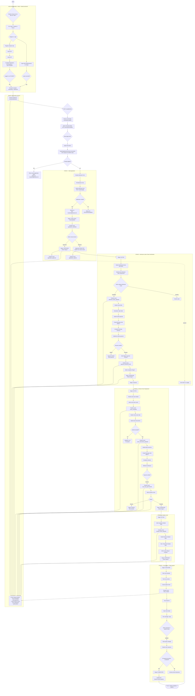

# V1.md

```mermaid
flowchart TD

%% ==============================
%% STUDENTS - FULL USER FLOW
%% ==============================

%% ---------- Entry / Auth ----------
A0((Start)) --> A1{"Student chooses role to sign up / sign in"}

subgraph AUTH["Auth and Registration - Public + Student protected"]

    A1 --> A2["Go to login - Student or Parent"]

    A2 --> B0{"Register or Login"}

    B0 --> C1["Register (Student role)"]
    C1 --> C2["Send OTP"]
    C2 --> C3["Verify OTP"]
    C3 --> C4["Complete Registration<br/>Set Password + role=STUDENT"]

    C4 --> C5{"Logged in as STUDENT?"}
    C5 -->|Yes| D0["Proceed to Student onboarding + dashboard"]

    B0 --> C6["Login with Email/Password or Google"]
    C6 --> C7{"Login successful?"}
    C7 -->|Yes| D0

end

%% ---------- Student Home / Dashboard ----------
D0 --> D1["Student Dashboard<br/>/student/dashboard"]
D1 --> D2{"Fetch my applications"}

%% ---------- Browse University ----------
D2 --> E1["Browse Universities<br/>/universities (public)"]

E1 --> E2["Open University details<br/>GET /universities/:identifier"]

E2 --> E3{"Show Apply Now?"}
E3 --> E4["Apply Now button"]

E4 --> F0["/student/applications/check/:universityId<br/>GET (requires STUDENT auth)"]

F0 --> F1{"Already applied?"}

F1 -->|Yes| F1a["Show current application status<br/>redirect to /student/applications/:id"]

F1 -->|No| G0["Render Admission Form"]

%% ---------- Stage 1 ----------
subgraph STAGE1["STAGE 1 - Initial Application"]

    G0 --> G1["Fill Admission Form"]

    G1 --> G2["Submit admission form<br/>POST /student/apply"]

    G2 --> G3{"Application created?"}

    G3 -->|Yes| G4["Redirect to<br/>GET /student/applications/:id"]

    G3 -->|No| G5["Show error<br/>401/403/409/validation"]

    G4 --> H0["Stage 1 status enters review pipeline"]

    H0 --> H1["Timeline event: application_submitted"]

    H1 --> H2{"Admin review decision"}

    H2 -->|Approved| H3["Stage 1 APPROVED<br/>Unlock Stage 2"]

    H2 -->|Rejected| H4["Application REJECTED<br/>Student can review reason"]

    H3 --> H5["Timeline event: application_approved"]

    H4 --> H6["Timeline event: application_rejected"]

end

%% ---------- Stage 2 ----------
subgraph STAGE2["STAGE 2 - Admission Letter & Seat Confirmation"]

    H6 -. rejected .-> R0["End of flow or re-apply"]

    H3 --> I0["Stage 2 ACTIVE"]

    I0 --> I1["Student dashboard shows next action"]

    I1 --> I2["Student sees Admission Letter requirement"]

    I2 --> J0{"Admin uploads Admission Letter"}

    J0 -->|Uploaded| J1["Timeline event: admission_letter_uploaded"]

    J0 -->|Pending| J2["Student waits"]

    J1 --> K0["Student views letter"]

    K0 --> K1["Download / Open letter"]

    K1 --> L0["Student starts payment"]

    L0 --> L1["Create Razorpay order<br/>stage=2"]

    L1 --> L2["Complete Razorpay checkout"]

    L2 --> L3["Webhook verifies payment"]

    L3 --> L4{"Payment verified?"}

    L4 -->|Success| L5["Mark Stage 2 payment received"]

    L5 --> L6["Timeline event: payment_received ₹5,000"]

    L6 --> L7["Admin completes Stage 2"]

    L7 --> L8["Stage 2 APPROVED<br/>Unlock Stage 3"]

    L4 -->|Failure| M0["Payment FAILED<br/>Retry payment"]

    L8 --> N0["Stage 3 unlocked"]

end

%% ---------- Stage 3 ----------
subgraph STAGE3["STAGE 3 - Entrance Exam Registration"]

    N0 --> O1["Stage 3 ACTIVE"]

    O1 --> O2["Student sees exam details"]

    O2 --> P0["Admin sets exam record"]

    P0 --> P1["Timeline event: exam_scheduled"]

    P1 --> Q0["Student views exam data"]

    Q0 --> Q1["Upload exam documents"]

    Q1 --> Q2{"Upload accepted?"}

    Q2 -->|Yes| Q3["Timeline event: exam_documents_uploaded"]

    Q2 -->|No| Q4["Validation error<br/>Re-upload"]

    Q3 --> R1["Student pays exam fee"]

    R1 --> R2["Create Razorpay order<br/>stage=3"]

    R2 --> R3["Complete checkout"]

    R3 --> R4["Webhook verification"]

    R4 --> R5{"Payment verified?"}

    R5 -->|Success| R6["Timeline event: exam_fee_paid ₹10,000"]

    R6 --> R7["Admin declares result"]

    R7 --> R8{"Result"}

    R8 -->|PASSED| S0["Stage 3 APPROVED<br/>Unlock Stage 4"]

    R8 -->|FAILED| T0["Stage 3 FAILED<br/>Retry allowed"]

end

%% ---------- Stage 4 ----------
subgraph STAGE4["STAGE 4 - Invitation Letter"]

    S0 --> U0["Stage 4 ACTIVE"]

    U0 --> U1["Admin uploads invitation letter"]

    U1 --> U2["Timeline event: invitation_letter_uploaded"]

    U2 --> V0["Student fetches invitation letter"]

    V0 --> V1["View / Download invitation letter"]

    V1 --> W0["Admin marks Stage 4 complete"]

    W0 --> W1["Stage 4 APPROVED<br/>Unlock Stage 5"]

end

%% ---------- Stage 5 ----------
subgraph STAGE5["STAGE 5 - Visa Support + Ticket Support"]

    W1 --> X0["Stage 5 UNLOCKED"]

    X0 --> X1["Fetch visa checklist"]

    X1 --> X2["Fetch visa centers"]

    X2 --> Y0["Create support ticket"]

    Y0 --> Y1["Timeline event: ticket_created"]

    Y1 --> Y2["View ticket list"]

    Y2 --> Y3["Open ticket detail"]

    Y3 --> Y4["Post message / reply"]

    Y4 --> Z0{"Admin responds or updates status"}

    Z0 -->|Updated| Z1["Ticket status changed"]

    Z1 --> Y5["Student sees response"]

    Y5 --> AA0{"All required visa items completed?"}

    AA0 -->|Yes| AA1["Stage 5 COMPLETED"]

    AA0 -->|No| AA2["Continue ticket interactions"]

    AA1 --> AB0["COMPLETE<br/>Student finished pipeline"]

end

%% ---------- System ----------
subgraph SYSTEM["System cross-cutting concerns"]

    N5["At each stage transition:<br/>- store docs/letters<br/>- verify payments<br/>- create timeline events<br/>- send notifications<br/>- audit actions"]

    D1 --> N5
    H3 --> N5
    J1 --> N5
    L6 --> N5
    L8 --> N5
    P1 --> N5
    Q3 --> N5
    R6 --> N5
    R8 --> N5
    U2 --> N5
    W1 --> N5
    Y1 --> N5

end

%% ---------- End ----------
AB0 --> END(["End - student completed pipeline"])

R0 --> END
```
