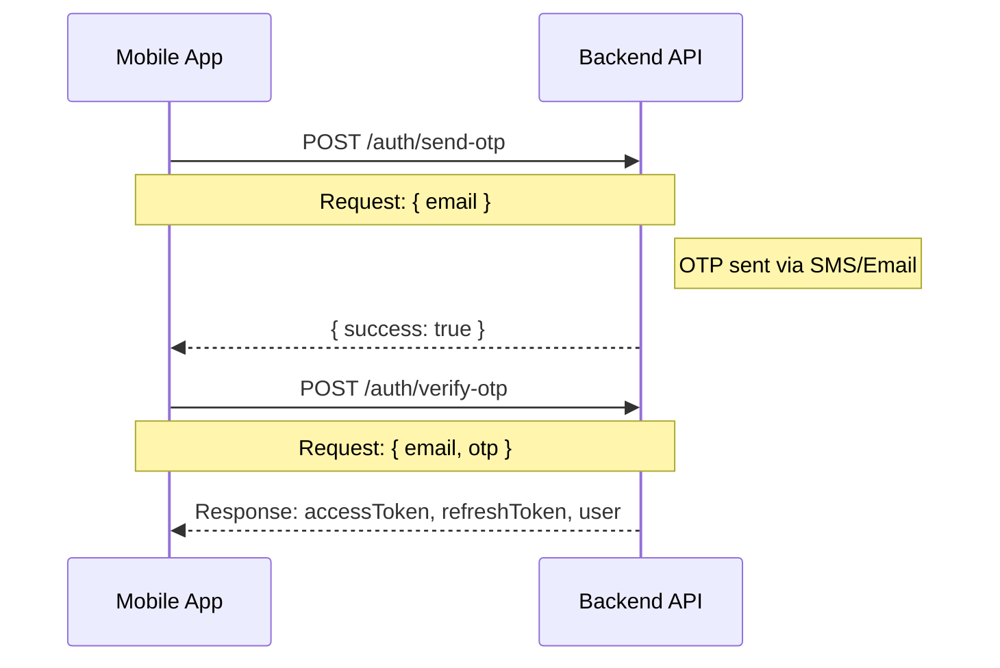
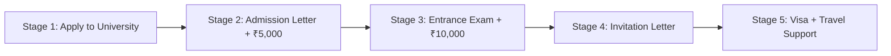
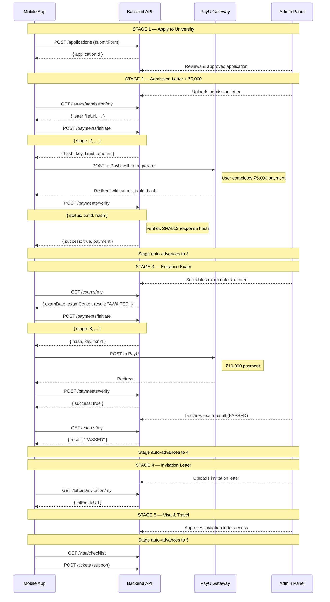
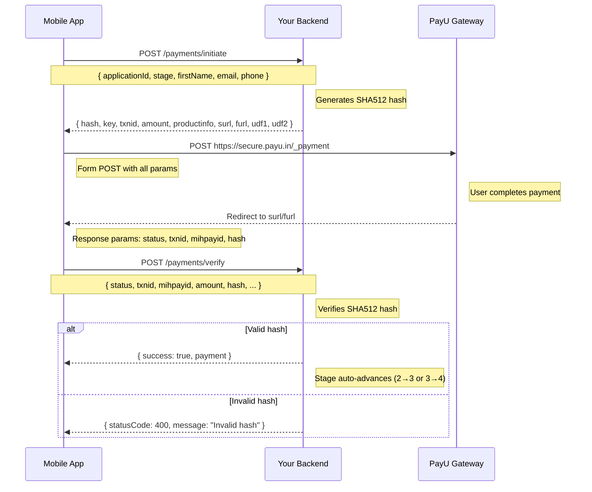
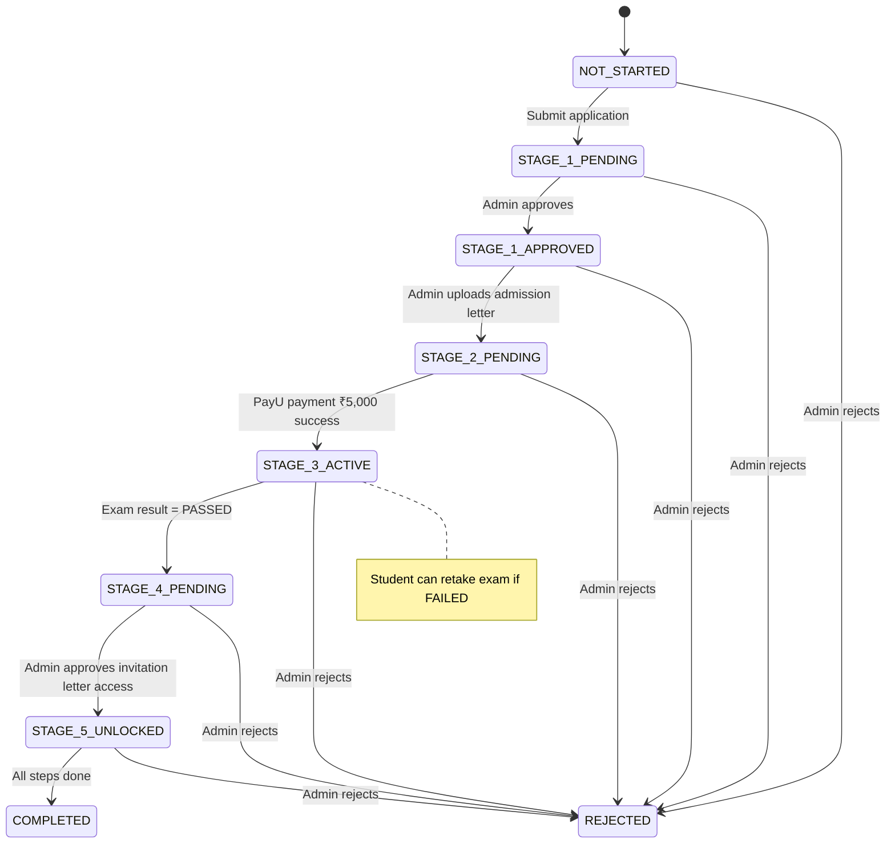

# API Integration Guide — Medical Admission Platform

> **For Mobile App Developers**  
> Complete API reference with flow diagrams, payload shapes, stage transitions, and error handling.

---

## Table of Contents

1. [Base URLs & Authentication](#1-base-urls--authentication)
2. [Stage Flow Overview](#2-stage-flow-overview)
3. [Flow Diagrams](#3-flow-diagrams)
4. [API Reference](#4-api-reference)
   - [Auth](#41-auth)
   - [Applications](#42-applications)
   - [Letters](#43-letters)
   - [Payments (PayU)](#44-payments-payu)
   - [Exams](#45-exams)
   - [Support Tickets](#46-support-tickets)
   - [Timeline](#47-timeline)
   - [Device Tokens](#48-device-tokens)
5. [Error Format](#5-error-format)
6. [Stage Mapping & Statuses](#6-stage-mapping--statuses)
7. [Environment Variables](#7-environment-variables)

---

## 1. Base URLs & Authentication

### Base URL

```
Production: https://api.shiksha.edu.in/api
Sandbox:    https://sandbox-api.shiksha.edu.in/api
```

### Authentication Flow



**All subsequent requests** must include:

```http
Authorization: Bearer <accessToken>
```

### JWT Payload (decoded)

```json
{
  "sub": "uuid",
  "id": "uuid",
  "email": "student@example.com",
  "role": "STUDENT"
}
```

### Token Refresh

```http
POST /auth/refresh
Body: { refreshToken: "..." }
Response: { accessToken, refreshToken }
```

---

## 2. Stage Flow Overview

The application progresses through **5 stages**. Each stage has requirements (payment, documents, letter upload) that must be completed before unlocking the next.



### Stage Requirements Matrix

| Stage | Name                | Payment | Document                     | Action Required                       | Unlocks When                        |
| ----- | ------------------- | ------- | ---------------------------- | ------------------------------------- | ----------------------------------- |
| 1     | Initial Application | —       | Photos, Marksheets, Passport | Submit application form               | Application approved by admin       |
| 2     | Admission Letter    | ₹5,000  | —                            | View letter + pay fee                 | Payment success                     |
| 3     | Entrance Exam       | ₹10,000 | Exam admit card              | Schedule exam + upload docs + pay fee | Payment success                     |
| 4     | Invitation Letter   | —       | —                            | Download invitation letter            | Exam passed (PASSED result)         |
| 5     | Visa & Travel       | —       | Visa docs, Tickets           | Upload visa docs, track tickets       | Admin approves invite letter access |

### Student.currentStage Values

| Value | Meaning                                                  |
| ----- | -------------------------------------------------------- |
| 1     | Initial Application (STAGE_1_PENDING → STAGE_1_APPROVED) |
| 2     | Admission Letter stage                                   |
| 3     | Entrance Exam stage                                      |
| 4     | Invitation Letter stage                                  |
| 5     | Visa Support stage                                       |

---

## 3. Flow Diagrams

### 3.1 Complete Student Journey



### 3.2 PayU Payment Flow



### 3.3 Stage Transition State Machine



---

## 4. API Reference

### 4.1 Auth

#### Send OTP

```http
POST /auth/send-otp
Content-Type: application/json

{
  "email": "student@example.com"
}
```

```json
// Response 200
{ "success": true, "message": "OTP sent" }
```

#### Verify OTP & Login

```http
POST /auth/verify-otp
Content-Type: application/json

{
  "email": "student@example.com",
  "otp": "123456",
  "name": "Rahul Kumar"  // Required only for first-time registration
}
```

```json
// Response 200
{
  "accessToken": "eyJhbGciOiJIUzI1NiIs...",
  "refreshToken": "dGhpcyBpcyBhIHJlZnJl...",
  "user": {
    "id": "user-uuid",
    "email": "student@example.com",
    "name": "Rahul Kumar",
    "role": "STUDENT",
    "studentId": "student-uuid" // Important: used in many endpoints
  }
}
```

#### Complete Registration

```http
POST /auth/complete-registration
Content-Type: application/json

{
  "email": "student@example.com",
  "otp": "123456",
  "name": "Rahul Kumar",
  "password": "securePassword123"
}
```

```json
// Response 200
{
  "accessToken": "eyJhbGciOiJIUzI1NiIs...",
  "refreshToken": "dGhpcyBpcyBhIHJlZnJl...",
  "user": {
    "id": "user-uuid",
    "email": "student@example.com",
    "name": "Rahul Kumar",
    "role": "STUDENT",
    "studentId": "student-uuid"
  }
}
```

#### Login

```http
POST /auth/login
Content-Type: application/json

{
  "email": "student@example.com",
  "password": "securePassword123"
}
```

```json
// Response 200
{
  "accessToken": "eyJhbGciOiJIUzI1NiIs...",
  "refreshToken": "dGhpcyBpcyBhIHJlZnJl...",
  "user": {
    "id": "user-uuid",
    "email": "student@example.com",
    "name": "Rahul Kumar",
    "role": "STUDENT",
    "studentId": "student-uuid"
  }
}
```

#### Google Login

```http
POST /auth/google-login
Content-Type: application/json

{
  "googleToken": "google_access_token_here"
}
```

```json
// Response 200
{
  "accessToken": "eyJhbGciOiJIUzI1NiIs...",
  "refreshToken": "dGhpcyBpcyBhIHJlZnJl...",
  "user": {
    "id": "user-uuid",
    "email": "student@example.com",
    "name": "Rahul Kumar",
    "role": "STUDENT",
    "studentId": "student-uuid"
  }
}
```

#### Forgot Password

```http
POST /auth/forgot-password
Content-Type: application/json

{
  "email": "student@example.com"
}
```

```json
// Response 200
{ "message": "Password reset OTP sent" }
```

#### Reset Password

```http
POST /auth/reset-password
Content-Type: application/json

{
  "email": "student@example.com",
  "otp": "123456",
  "newPassword": "newSecurePassword123"
}
```

```json
// Response 200
{ "message": "Password reset successfully" }
```

### 4.2 Applications

List of common error responses:

```json
// 401 Unauthorized
{ "message": "Unauthorized", "statusCode": 401 }

// 403 Forbidden (role mismatch)
{ "message": "Forbidden resource", "statusCode": 403 }

// 404 Not Found
{ "message": "Application not found", "statusCode": 404 }

// 400 Bad Request
{ "message": "Please complete previous stages first", "statusCode": 400 }
```

#### Get My Applications

```http
GET /student/applications
Authorization: Bearer <token>
```

```json
// Response 200
{
  "applications": [
    {
      "id": "app-uuid",
      "status": "approved",
      "university": {
        "id": "uni-uuid",
        "name": "Tashkent Medical Academy",
        "shortName": "TMA",
        "logo": "https://..."
      },
      "selectedProgram": "MBBS",
      "submittedAt": "2025-05-20T10:30:00Z",
      "currentStage": 2,
      "applicationStatus": "STAGE_2_PENDING"
    }
  ]
}
```

#### Get Single Application

```http
GET /student/applications/:id
Authorization: Bearer <token>
```

```json
// Response 200
{
  "id": "app-uuid",
  "status": "approved",
  "firstName": "Rahul",
  "lastName": "Kumar",
  "email": "rahul@example.com",
  "selectedProgram": "MBBS",
  "submittedAt": "2025-05-20T10:30:00Z",
  "formData": { ... },
  "university": { ... },
  "currentStage": 2,
  "applicationStatus": "STAGE_2_PENDING"
}
```

### 4.3 Letters

#### Get My Admission Letter

```http
GET /letters/admission/my
Authorization: Bearer <token>
```

```json
// Response 200
{
  "id": "letter-uuid",
  "applicationId": "app-uuid",
  "fileUrl": "https://signed-url...", // Pre-signed, temporary
  "fileName": "admission_letter_rahul.pdf",
  "uploadedAt": "2025-05-21T10:00:00Z",
  "viewCount": 3,
  "downloadCount": 1
}
```

#### Upload Admission Letter (Admin)

```http
POST /letters/admission
Authorization: Bearer <admin-token>
Content-Type: application/json

{
  "applicationId": "app-uuid",
  "fileUrl": "https://s3-url...",
  "fileName": "admission_letter_rahul.pdf"
}
```

```json
// Response 200
{
  "id": "letter-uuid",
  "studentId": "student-uuid",
  "applicationId": "app-uuid",
  "fileUrl": "https://...",
  "uploadedAt": "2025-05-21T10:00:00Z"
}
```

> **Note:** Uploading a letter **auto-advances** student from Stage 1 to Stage 2.
> A notification + timeline event is created automatically.

#### Track Admission Letter Download

```http
POST /letters/admission/:applicationId/download
Authorization: Bearer <token>
```

> Used to increment download count. Mobile should call this when actual download completes.

#### Get My Invitation Letter

```http
GET /letters/invitation/my
Authorization: Bearer <token>
```

```json
// Response 200
{
  "id": "letter-uuid",
  "applicationId": "app-uuid",
  "fileUrl": "https://signed-url...",
  "fileName": "invitation_letter.pdf",
  "isDownloadable": true,
  "viewCount": 2,
  "downloadCount": 1,
  "uploadedAt": "2025-05-25T10:00:00Z"
}
```

#### Approve Invitation Letter Access (Admin)

```http
POST /letters/invitation/:applicationId/approve-access
Authorization: Bearer <admin-token>
```

```json
// Response 200
{
  "message": "Invitation letter access approved. Stage 5 unlocked."
}
```

> Sets `isDownloadable = true` AND **auto-advances** to Stage 5.
> Creates timeline event + notification.

### 4.4 Payments (PayU)

**IMPORTANT:** This app uses **PayU** (not Razorpay). The flow is:

1. Call `POST /payments/initiate` to get the PayU form parameters
2. Use those parameters to POST to PayU's server from your app
3. PayU redirects back with response parameters
4. Call `POST /payments/verify` to verify the response hash

#### Initiate Payment (Step 1)

```http
POST /payments/initiate
Authorization: Bearer <token>
Content-Type: application/json

{
  "applicationId": "app-uuid",
  "stage": 2,
  "firstName": "Rahul",
  "email": "rahul@example.com",
  "phone": "9999999999"
}
```

```json
// Response 200
{
  "paymentId": "pay-uuid",
  "hash": "e3b0c44298fc1c149afbf4c8996fb92427ae41e4649b934ca495991b7852b855",
  "key": "merchant_key_from_payu",
  "txnid": "TXNabc123def456",
  "amount": "5000",
  "productinfo": "Stage_2_Admission Fee",
  "firstname": "Rahul",
  "email": "rahul@example.com",
  "phone": "9999999999",
  "surl": "https://your-app.com/payments/success",
  "furl": "https://your-app.com/payments/failure",
  "service_provider": "payu_paisa",
  "udf1": "app-uuid", // ← Always the applicationId
  "udf2": "2", // ← Always the stage number
  "udf3": "",
  "udf4": "",
  "udf5": ""
}
```

**Mobile Implementation (Step 2):**

```kotlin
// Android — Open PayU in WebView or use PayU SDK
val formParams = mapOf(
    "key" to response.key,
    "txnid" to response.txnid,
    "amount" to response.amount,
    "productinfo" to response.productinfo,
    "firstname" to response.firstname,
    "email" to response.email,
    "phone" to response.phone,
    "hash" to response.hash,
    "surl" to response.surl,
    "furl" to response.furl,
    "udf1" to response.udf1,
    "udf2" to response.udf2
)

// POST these params to: https://secure.payu.in/_payment
// (or use test URL for sandbox: https://test.payu.in/_payment)
```

```swift
// iOS — Open PayU in WKWebView
let payUUrl = "https://secure.payu.in/_payment"
var request = URLRequest(url: URL(string: payUUrl)!)
request.httpMethod = "POST"
let body = formParams.map { "\($0.key)=\($0.value)" }.joined(separator: "&")
request.httpBody = body.data(using: .utf8)
webView.load(request)
```

#### Verify Payment (Step 3 — called after PayU redirect)

```http
POST /payments/verify
Content-Type: application/json

{
  "status": "success",
  "txnid": "TXNabc123def456",
  "mihpayid": "payu_reference_id",
  "amount": "5000",
  "productinfo": "Stage_2_Admission Fee",
  "firstname": "Rahul",
  "email": "rahul@example.com",
  "hash": "response_hash_from_payu",
  "udf1": "app-uuid",
  "udf2": "2",
  "bank_ref_num": "BANK12345",
  "mode": "UPI",
  "payumoney_id": "payu_id",
  "card_type": "",
  "error": "",
  "error_Message": ""
}
```

```json
// Response 200 — success
{
  "success": true,
  "payment": {
    "id": "pay-uuid",
    "status": "SUCCESS",
    "amount": 5000,
    "stage": 2,
    "paidAt": "2025-05-22T14:30:00Z",
    "razorpayPaymentId": "payu_reference_id",
    "paymentMethod": "UPI"
  }
}

// Response 200 — failed
{
  "success": false,
  "payment": {
    "id": "pay-uuid",
    "status": "FAILED",
    "error": "Payment declined by bank"
  }
}
```

> **On success:** Stage auto-advances (2→3 or 3→4). Timeline event + notification created.

#### Possible Error Responses

```json
// 400 — Invalid stage
{ "message": "Invalid payment stage. Valid stages: 2 (admission fee), 3 (exam fee)", "statusCode": 400 }

// 400 — Wrong order
{ "message": "Please complete previous stages first", "statusCode": 400 }

// 400 — Signature mismatch
{ "message": "Invalid payment response hash", "statusCode": 400 }
```

#### Get Payment History

```http
GET /payments/history?applicationId=app-uuid
Authorization: Bearer <token>
```

```json
// Response 200
[
  {
    "id": "pay-uuid",
    "stage": 2,
    "amount": 5000,
    "status": "SUCCESS",
    "paymentMethod": "UPI",
    "paidAt": "2025-05-22T14:30:00Z",
    "razorpayOrderId": "TXNabc123..."
  }
]
```

#### Get Payment Config

```http
GET /payments/config
Authorization: Bearer <token>
```

```json
// Response 200
[
  {
    "stage": 2,
    "label": "Admission Fee",
    "amount": 5000,
    "description": "Admission letter processing fee"
  },
  {
    "stage": 3,
    "label": "Exam Fee",
    "amount": 10000,
    "description": "Entrance examination fee"
  }
]
```

### 4.5 Exams

#### Get My Exam

```http
GET /exams/my
Authorization: Bearer <token>
```

```json
// Response 200 — Scheduled
{
  "id": "exam-uuid",
  "applicationId": "app-uuid",
  "examDate": "2025-06-15T10:00:00Z",
  "examSubject": "Biology & Chemistry",
  "examCenter": "Tashkent Medical Academy - Block A",
  "result": "AWAITED",
  "attemptNumber": 1
}

// Response 200 — Result declared
{
  "id": "exam-uuid",
  "applicationId": "app-uuid",
  "examDate": "2025-06-15T10:00:00Z",
  "examSubject": "Biology & Chemistry",
  "examCenter": "Tashkent Medical Academy - Block A",
  "result": "PASSED",
  "resultDeclaredAt": "2025-06-18T14:00:00Z",
  "resultRemarks": "Score: 85/100",
  "attemptNumber": 1
}

// Response 404
{ "message": "Exam record not found", "statusCode": 404 }
```

> When `result: "PASSED"`, stage auto-advances from 3→4.
> When `result: "FAILED"`, student stays on stage 3 and can retake.

#### Get Exam by Application

```http
GET /exams/application/:applicationId
Authorization: Bearer <token>
```

Response same shape as above.

### 4.6 Support Tickets

#### Create Ticket

```http
POST /tickets
Authorization: Bearer <token>
Content-Type: application/json

{
  "subject": "Need help with document upload",
  "description": "I am unable to upload my 12th marksheet",
  "applicationId": "app-uuid",     // Optional: links ticket to application
  "priority": "MEDIUM"              // Optional: LOW, MEDIUM, HIGH, URGENT
}
```

```json
// Response 201
{
  "id": "ticket-uuid",
  "userId": "user-uuid",
  "applicationId": "app-uuid",
  "subject": "Need help with document upload",
  "status": "OPEN",
  "priority": "MEDIUM",
  "createdAt": "2025-05-23T10:00:00Z",
  "messages": [
    {
      "id": "msg-uuid",
      "senderId": "user-uuid",
      "senderRole": "STUDENT",
      "content": "I am unable to upload my 12th marksheet",
      "createdAt": "2025-05-23T10:00:00Z"
    }
  ]
}
```

#### Get My Tickets

```http
GET /tickets/my
Authorization: Bearer <token>
```

```json
// Response 200
[
  {
    "id": "ticket-uuid",
    "subject": "Need help with document upload",
    "status": "IN_PROGRESS",
    "priority": "MEDIUM",
    "updatedAt": "2025-05-23T12:00:00Z",
    "messages": [
      {
        "senderRole": "ADMIN",
        "content": "Please try clearing cache...",
        "createdAt": "2025-05-23T12:00:00Z"
      }
    ]
  }
]
```

#### Get Application Tickets

```http
GET /tickets/application/:applicationId
Authorization: Bearer <token>
```

#### Get Single Ticket

```http
GET /tickets/:ticketId
Authorization: Bearer <token>
```

```json
// Response 200
{
  "id": "ticket-uuid",
  "subject": "...",
  "status": "OPEN",
  "priority": "MEDIUM",
  "createdAt": "...",
  "updatedAt": "...",
  "messages": [
    {
      "id": "m1",
      "senderId": "...",
      "senderRole": "STUDENT",
      "content": "...",
      "createdAt": "..."
    },
    {
      "id": "m2",
      "senderId": "...",
      "senderRole": "ADMIN",
      "content": "...",
      "createdAt": "..."
    }
  ]
}
```

#### Add Message to Ticket

```http
POST /tickets/:ticketId/messages
Authorization: Bearer <token>
Content-Type: application/json

{
  "content": "Thanks, clearing cache worked!",
  "attachments": []   // Optional: array of URLs
}
```

```json
// Response 201
{
  "id": "new-msg-uuid",
  "ticketId": "ticket-uuid",
  "senderId": "user-uuid",
  "senderRole": "STUDENT",
  "content": "Thanks, clearing cache worked!",
  "createdAt": "2025-05-23T14:00:00Z"
}
```

> If student replies to a `WAITING_FOR_CUSTOMER` ticket, status auto-changes to `IN_PROGRESS`.

### 4.7 Timeline

#### Get Application Timeline

```http
GET /timeline/application/:applicationId
Authorization: Bearer <token>
```

```json
// Response 200
[
  {
    "id": "evt-uuid",
    "applicationId": "app-uuid",
    "studentId": "student-uuid",
    "stage": 1,
    "event": "APPLICATION_SUBMITTED",
    "title": "Application Submitted",
    "description": "Your university application has been submitted successfully.",
    "occurredAt": "2025-05-20T10:30:00Z",
    "isCompleted": true,
    "isActive": false,
    "metadata": { "submittedAt": "2025-05-20T10:30:00Z" }
  },
  {
    "id": "evt-uuid",
    "applicationId": "app-uuid",
    "studentId": "student-uuid",
    "stage": 2,
    "event": "ADMISSION_LETTER_ISSUED",
    "title": "Admission Letter Issued",
    "description": "Your admission letter has been uploaded.",
    "occurredAt": "2025-05-21T10:00:00Z",
    "isCompleted": true,
    "isActive": false,
    "metadata": {}
  },
  {
    "id": "evt-uuid",
    "applicationId": "app-uuid",
    "studentId": "student-uuid",
    "stage": 2,
    "event": "PAYMENT_STAGE_2_COMPLETED",
    "title": "Admission Fee Paid",
    "description": "Payment of ₹5,000 completed successfully.",
    "occurredAt": "2025-05-22T14:30:00Z",
    "isCompleted": true,
    "isActive": true,
    "metadata": { "amount": 5000 }
  }
]
```

**UI Hint:** The last event with `isActive: true` is the current position. Show earlier events as "completed" (green), the active one as "current" (blue/orange), and future ones as "locked" (gray).

#### Get My Timeline (Student)

```http
GET /timeline/my
Authorization: Bearer <token>
```

```json
// Response 200
[
  {
    "id": "evt-uuid",
    "applicationId": "app-uuid",
    "studentId": "student-uuid",
    "stage": 1,
    "event": "APPLICATION_SUBMITTED",
    "title": "Application Submitted",
    "description": "Your university application has been submitted successfully.",
    "occurredAt": "2025-05-20T10:30:00Z",
    "isCompleted": true,
    "isActive": false,
    "metadata": { "submittedAt": "2025-05-20T10:30:00Z" }
  },
  {
    "id": "evt-uuid",
    "applicationId": "app-uuid",
    "studentId": "student-uuid",
    "stage": 2,
    "event": "ADMISSION_LETTER_ISSUED",
    "title": "Admission Letter Issued",
    "description": "Your admission letter has been uploaded.",
    "occurredAt": "2025-05-21T10:00:00Z",
    "isCompleted": true,
    "isActive": false,
    "metadata": {}
  }
]
```

**Notes:**
- The actual API endpoint is `/timeline/` not `/students/applications/:applicationId/timeline`
- The timeline events include additional fields: `applicationId` and `studentId` 
- The `isActive` field is computed dynamically based on the latest event in the timeline
- The `isCompleted` field is always `true` for all events

#### Get My Timeline (Student)

```http
GET /timeline/my
Authorization: Bearer <token>
```

```json
// Response 200
[
  {
    "id": "evt-uuid",
    "applicationId": "app-uuid",
    "studentId": "student-uuid",
    "stage": 1,
    "event": "APPLICATION_SUBMITTED",
    "title": "Application Submitted",
    "description": "Your university application has been submitted successfully.",
    "occurredAt": "2025-05-20T10:30:00Z",
    "isCompleted": true,
    "isActive": false,
    "metadata": { "submittedAt": "2025-05-20T10:30:00Z" }
  },
  {
    "id": "evt-uuid",
    "applicationId": "app-uuid",
    "studentId": "student-uuid",
    "stage": 2,
    "event": "ADMISSION_LETTER_ISSUED",
    "title": "Admission Letter Issued",
    "description": "Your admission letter has been uploaded.",
    "occurredAt": "2025-05-21T10:00:00Z",
    "isCompleted": true,
    "isActive": false,
    "metadata": {}
  }
]
```

**Notes:**
- The actual API endpoint is `/timeline/` not `/students/applications/:applicationId/timeline`
- The timeline events include additional fields: `applicationId` and `studentId` 
- The `isActive` field is computed dynamically based on the latest event in the timeline
- The `isCompleted` field is always `true` for all events

### 4.8 Device Tokens

#### Register Device Token (for Push Notifications)

```http
POST /device-tokens
Authorization: Bearer <token>
Content-Type: application/json

{
  "token": "fcm_device_token_abc123",
  "platform": "android"     // "ios", "android", or "web"
}
```

```json
// Response 200
{
  "id": "dt-uuid",
  "token": "fcm_device_token_abc123",
  "platform": "android",
  "isActive": true
}
```

#### Unregister Device Token

```http
DELETE /device-tokens/:token
Authorization: Bearer <token>
```

> Marks the token as inactive (soft delete).

#### Get My Device Tokens

```http
GET /device-tokens
Authorization: Bearer <token>
```

```json
// Response 200
[
  {
    "id": "dt-uuid",
    "token": "fcm_device_token_abc123",
    "platform": "android",
    "isActive": true,
    "createdAt": "2025-05-20T10:00:00Z"
  }
]
```

---

## 5. Error Format

All errors follow a standard format:

```json
// 400 Bad Request (validation)
{
  "message": ["firstName must be a string", "email must be an email"],
  "error": "Bad Request",
  "statusCode": 400
}

// 400 Bad Request (business logic)
{
  "message": "Invalid payment stage. Valid stages: 2 (admission fee), 3 (exam fee)",
  "statusCode": 400
}

// 401 Unauthorized
{
  "message": "Unauthorized",
  "statusCode": 401
}

// 403 Forbidden
{
  "message": "Forbidden resource",
  "statusCode": 403
}

// 404 Not Found
{
  "message": "Admission letter not found",
  "statusCode": 404
}

// 500 Internal Server
{
  "message": "Internal server error",
  "statusCode": 500
}
```

### Common Business Validation Errors

| Error Message                                                    | When It Occurs                                        |
| ---------------------------------------------------------------- | ----------------------------------------------------- |
| `"Please complete previous stages first"`                        | Trying to pay for stage 3 without completing stage 2  |
| `"Application must be approved before issuing admission letter"` | Admin uploading letter before application approval    |
| `"Invalid payment stage"`                                        | Using stage ≠ 2 or 3                                  |
| `"Invalid payment response hash"`                                | PayU response hash doesn't match — possible tampering |
| `"Student profile not found"`                                    | JWT user doesn't have a linked Student record         |
| `"Application not found"`                                        | Wrong application UUID or doesn't belong to user      |

---

## 6. Stage Mapping & Statuses

### ApplicationStatus Enum

```typescript
enum ApplicationStatus {
  NOT_STARTED
  STAGE_1_PENDING
  STAGE_1_IN_REVIEW
  STAGE_1_APPROVED
  STAGE_2_PENDING
  STAGE_2_IN_REVIEW
  STAGE_2_APPROVED
  STAGE_3_ACTIVE
  STAGE_4_PENDING
  STAGE_4_APPROVED
  STAGE_5_UNLOCKED
  COMPLETED
  REJECTED
}
```

### Stage Progression Triggers

| From → To                          | Trigger                                 | Who           |
| ---------------------------------- | --------------------------------------- | ------------- |
| NOT_STARTED → STAGE_1_PENDING      | Submit application                      | Student       |
| STAGE_1_PENDING → STAGE_1_APPROVED | Admin approves application              | Admin         |
| STAGE_1_APPROVED → STAGE_2_PENDING | Admin uploads admission letter          | Admin (auto)  |
| STAGE_2_PENDING → STAGE_3_ACTIVE   | Stage 2 payment success (₹5,000)        | System (auto) |
| STAGE_3_ACTIVE → STAGE_4_PENDING   | Exam result = PASSED                    | Admin (auto)  |
| STAGE_4_PENDING → STAGE_5_UNLOCKED | Admin approves invitation letter access | Admin (auto)  |
| STAGE_5_UNLOCKED → COMPLETED       | Admin marks complete                    | Admin         |
| ANY → REJECTED                     | Admin rejects                           | Admin         |

### Mobile App — Stage Display Logic

```swift
// Pseudo-code for rendering the stage indicator
func stageIndicator(stage: Int, status: String) -> StageView {
    switch (stage, status) {
    case (1, "STAGE_1_PENDING"):  return .inProgress("Application Under Review")
    case (1, "STAGE_1_APPROVED"): return .completed("Application Approved")
    case (2, _):                  return .inProgress("Pay Admission Fee (₹5,000)")
    case (3, "STAGE_3_ACTIVE"):   return .inProgress("Entrance Exam Scheduled")
    case (4, _):                  return .inProgress("Download Invitation Letter")
    case (5, _):                  return .inProgress("Visa & Travel Support")
    case (_, "COMPLETED"):        return .completed("All Done! 🎉")
    case (_, "REJECTED"):         return .failed("Application Rejected")
    default:                      return .locked("Stage \(stage)")
    }
}
```

---

## 7. Environment Variables

For the app, store these securely:

```env
# API
API_BASE_URL=https://api.shiksha.edu.in/api

# Auth
JWT_ACCESS_SECRET=<from-backend-team>

# PayU (used only on backend, but app needs these for reference)
PAYU_MERCHANT_KEY=<from-backend-team>
PAYU_SALT=<from-backend-team>

# PayU URLs — where PayU redirects after payment
PAYU_SURL=<app-scheme>://payments/success    # or https://your-app-callback.com/success
PAYU_FURL=<app-scheme>://payments/failure    # or https://your-app-callback.com/failure

# PayU endpoints
PAYU_PAYMENT_URL=https://secure.payu.in/_payment       # Production
PAYU_PAYMENT_URL_TEST=https://test.payu.in/_payment    # Sandbox

# Feature Flags (can be fetched from API)
FEATURE_EXAMS=true
FEATURE_VISA=true
```

---

## Quick Reference Card

```
┌─────────────────────────────────────────────────────────────────┐
│                   QUICK API REFERENCE CARD                       │
├─────────────────────────────────────────────────────────────────┤
│                                                                   │
│  AUTH                                                             │
│  POST /auth/send-otp        → OTP sent                           │
│  POST /auth/verify-otp      → { accessToken, refreshToken }      │
│  POST /auth/complete-registration → { accessToken, refreshToken } │
│  POST /auth/login           → { accessToken, refreshToken }      │
│  POST /auth/google-login    → { accessToken, refreshToken }      │
│  POST /auth/forgot-password → OTP sent                           │
│  POST /auth/reset-password  → Password reset                     │
│  POST /auth/refresh         → { accessToken, refreshToken }      │
│  GET  /auth/me              → { user }                           │
│                                                                   │
│  APPLICATIONS                                                     │
│  GET  /student/applications          → list of applications       │
│  GET  /student/applications/:id      → single application         │
│                                                                   │
│  TIMELINE                                                         │
│  GET  /timeline/application/:id → stage timeline events           │
│  GET  /timeline/my → my timeline events                            │
│                                                                   │
│  LETTERS                                                          │
│  GET  /letters/admission/my          → my admission letter        │
│  GET  /letters/invitation/my          → my invitation letter      │
│  POST /letters/admission/:appId/download → track download         │
│                                                                   │
│  PAYMENTS (PayU)                                                  │
│  POST /payments/initiate        → { hash, key, txnid, ... }       │
│  POST /payments/verify          → { success, payment }           │
│  GET  /payments/history         → payment history                 │
│  GET  /payments/config          → stage config & amounts          │
│                                                                   │
│  EXAMS                                                            │
│  GET  /exams/my                 → my exam details                 │
│  GET  /exams/application/:id    → exam by application             │
│                                                                   │
│  TICKETS                                                          │
│  POST /tickets                  → create ticket                   │
│  GET  /tickets/my               → my tickets                      │
│  GET  /tickets/application/:id  → app-scoped tickets              │
│  POST /tickets/:id/messages     → add message                     │
│                                                                   │
│  DEVICE TOKENS                                                    │
│  POST /device-tokens            → register push token             │
│  GET  /device-tokens            → list my tokens                  │
│  DELETE /device-tokens/:token   → unregister                      │
│                                                                   │
│  STAGE MAPPING                                                     │
│  Stage 1: Apply to University                                      │
│  Stage 2: Admission Letter + ₹5,000                               │
│  Stage 3: Entrance Exam + ₹10,000                                 │
│  Stage 4: Invitation Letter                                        │
│  Stage 5: Visa + Travel Support                                    │
│                                                                   │
│  PAYU PAYMENT FLOW                                                 │
│  1. POST /payments/initiate     → get hash+params                  │
│  2. POST params to PayU gateway → user pays                       │
│  3. PayU redirects back         → capture response params          │
│  4. POST /payments/verify       → verify hash & update server      │
│                                                                   │
└─────────────────────────────────────────────────────────────────┘
```

---

_Last updated: May 2026_  
_For questions: backend-team@shiksha.edu.in_
