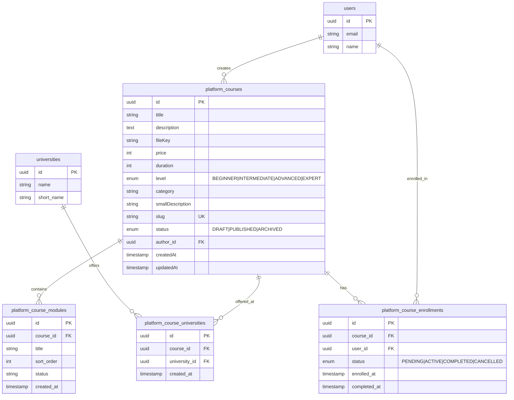

# Database Schema - Platform Courses Module

## Overview

This document outlines the database schema for the Platform Courses module - an educational course system where users can create and manage courses.

## Entity Relationship Diagram



## Tables

### 1. platform_courses

Main entity table storing course information. Each course is created by one user (1:N relationship).

| Field | Type | Description |
|-------|------|-------------|
| id | uuid | Primary key |
| title | string | Course title |
| description | text | Full course description (long) |
| fileKey | string | S3/R2 file key for course resources |
| price | int | Course price in smallest currency unit (cents/paise) |
| duration | int | Course duration in hours |
| level | enum | BEGINNER / INTERMEDIATE / ADVANCED / EXPERT |
| category | string | Course category |
| smallDescription | string | Short description for cards/previews |
| slug | string | URL-friendly unique identifier |
| status | enum | DRAFT / PUBLISHED / ARCHIVED (default: DRAFT) |
| author_id | uuid | Foreign key to users (course creator) |
| createdAt | timestamp | Record creation time |
| updatedAt | timestamp | Last update time |

### 2. platform_course_universities

Junction table for many-to-many relationship between courses and universities.

| Field | Type | Description |
|-------|------|-------------|
| id | uuid | Primary key |
| course_id | uuid | Foreign key to platform_courses (CASCADE) |
| university_id | uuid | Foreign key to universities (CASCADE) |
| created_at | timestamp | Record creation time |

### 3. platform_course_modules

Course content modules/sections. Cascade deleted when course is deleted.

| Field | Type | Description |
|-------|------|-------------|
| id | uuid | Primary key |
| course_id | uuid | Foreign key to platform_courses (CASCADE) |
| title | string | Module title |
| sort_order | int | Display order |
| status | string | ACTIVE / INACTIVE |
| created_at | timestamp | Record creation time |

### 4. platform_course_enrollments

Student enrollments in courses. Cascade deleted when user or course is deleted.

| Field | Type | Description |
|-------|------|-------------|
| id | uuid | Primary key |
| course_id | uuid | Foreign key to platform_courses (CASCADE) |
| user_id | uuid | Foreign key to users (CASCADE) |
| status | enum | PENDING / ACTIVE / COMPLETED / CANCELLED |
| enrolled_at | timestamp | Enrollment time |
| completed_at | timestamp | Completion time (optional) |

## Relationships

- **users → platform_courses**: One-to-many (1 user creates many courses)
- **users → platform_course_enrollments**: One-to-many (1 user enrolled in many courses)
- **platform_courses → platform_course_enrollments**: One-to-many (1 course has many enrollments)
- **platform_courses ↔ universities**: Many-to-many via `platform_course_universities`
- **platform_courses → platform_course_modules**: One-to-many (1 course has many modules)

## Cascade Delete Rules

| Table | On Course Delete | On User Delete | On University Delete |
|-------|-----------------|----------------|---------------------|
| platform_course_universities | CASCADE | - | CASCADE |
| platform_course_modules | CASCADE | - | - |
| platform_course_enrollments | CASCADE | CASCADE | - |

## Indexes

```sql
-- platform_courses table
CREATE INDEX idx_platform_courses_author_id ON platform_courses(author_id);
CREATE INDEX idx_platform_courses_status ON platform_courses(status);
CREATE INDEX idx_platform_courses_level ON platform_courses(level);
CREATE INDEX idx_platform_courses_category ON platform_courses(category);
CREATE UNIQUE INDEX idx_platform_courses_slug ON platform_courses(slug);

-- platform_course_universities table
CREATE INDEX idx_platform_course_universities_course_id ON platform_course_universities(course_id);
CREATE INDEX idx_platform_course_universities_university_id ON platform_course_universities(university_id);

-- platform_course_modules table
CREATE INDEX idx_platform_course_modules_course_id ON platform_course_modules(course_id);

-- platform_course_enrollments table
CREATE INDEX idx_platform_course_enrollments_course_id ON platform_course_enrollments(course_id);
CREATE INDEX idx_platform_course_enrollments_user_id ON platform_course_enrollments(user_id);
```

## Prisma Schema

```prisma
model PlatformCourse {
  id               String           @id @default(uuid())
  title            String
  description      String           @db.Text
  fileKey          String
  price            Int
  duration         Int              // Duration in hours
  level            CourseLevel
  category         String
  smallDescription String
  slug             String           @unique
  status           CourseItemStatus @default(DRAFT)
  createdAt        DateTime         @default(now())
  updatedAt        DateTime         @updatedAt

  // Relations - 1 User creates many courses
  authorId         String
  author           User             @relation(fields: [authorId], references: [id], onDelete: Cascade)
  
  universities     PlatformCourseUniversity[]
  modules          PlatformCourseModule[]
  enrollments      PlatformCourseEnrollment[]

  @@index([authorId])
  @@index([status])
  @@index([level])
  @@index([category])
  @@map("platform_courses")
}

model PlatformCourseUniversity {
  id            String   @id @default(uuid())
  courseId      String   @map("course_id")
  universityId  String   @map("university_id")
  createdAt     DateTime @default(now()) @map("created_at")

  course      PlatformCourse @relation(fields: [courseId], references: [id], onDelete: Cascade)
  university  University     @relation(fields: [universityId], references: [id], onDelete: Cascade)

  @@index([courseId])
  @@index([universityId])
  @@map("platform_course_universities")
}

model PlatformCourseModule {
  id          String   @id @default(uuid())
  courseId    String   @map("course_id")
  title       String
  sortOrder   Int      @map("sort_order")
  status      String   @default("ACTIVE")
  createdAt   DateTime @default(now()) @map("created_at")

  course PlatformCourse @relation(fields: [courseId], references: [id], onDelete: Cascade)

  @@index([courseId])
  @@map("platform_course_modules")
}

model PlatformCourseEnrollment {
  id            String                    @id @default(uuid())
  courseId      String                    @map("course_id")
  userId        String                    @map("user_id")
  status        PlatformEnrollmentStatus  @default(PENDING)
  enrolledAt    DateTime                  @default(now()) @map("enrolled_at")
  completedAt   DateTime?                 @map("completed_at")

  course PlatformCourse @relation(fields: [courseId], references: [id], onDelete: Cascade)
  user   User           @relation(fields: [userId], references: [id], onDelete: Cascade)

  @@index([courseId])
  @@index([userId])
  @@map("platform_course_enrollments")
}

enum CourseLevel {
  BEGINNER
  INTERMEDIATE
  ADVANCED
  EXPERT
}

enum CourseItemStatus {
  DRAFT
  PUBLISHED
  ARCHIVED
}

enum PlatformEnrollmentStatus {
  PENDING
  ACTIVE
  COMPLETED
  CANCELLED
}
```

## Sample Data

### platform_courses

| id | title | description | fileKey | price | duration | level | category | smallDescription | slug | status | author_id |
|----|-------|-------------|---------|-------|----------|-------|----------|------------------|------|--------|-----------|
| 1 | NEET Preparation | Complete NEET exam preparation course... | courses/neet-2024.pdf | 499900 | 120 | ADVANCED | Medical Entrance | Crack NEET with structured prep | neet-preparation-2024 | PUBLISHED | uuid-here |
| 2 | FMGE Coaching | Foreign Medical Graduate Examination... | courses/fmge-2024.pdf | 299900 | 80 | INTERMEDIATE | Licensing Exam | Pass FMGE on first attempt | fmge-coaching-2024 | PUBLISHED | uuid-here |
| 3 | Medical Basics | Foundation course for medical students... | courses/basics-2024.pdf | 99900 | 40 | BEGINNER | Foundation | Build strong medical foundation | medical-basics-2024 | DRAFT | uuid-here |

## Multi-File Prisma Setup

You can keep the course schema in a separate file:

1. **Create separate file**: `prisma/courses.schema.prisma`
2. **Install merge tool**: `npm install -D prisma-import`
3. **Add to package.json**:
```json
{
  "scripts": {
    "prisma:merge": "prisma-import",
    "prisma:generate": "npm run prisma:merge && prisma generate",
    "prisma:migrate": "npm run prisma:merge && prisma migrate dev"
  }
}
```
4. **Run**: `npm run prisma:merge` to combine files before `prisma generate`

Or manually copy the models from `courses.schema.prisma` into your main `schema.prisma` file.

## Files Created

1. `apps/api/prisma/courses.schema.prisma` - Separate schema file for courses
2. Updated `apps/api/prisma/schema.prisma` - Main schema with PlatformCourse models
3. `docs/database-schema-courses.md` - This documentation
