# User Flow — Students (Mermaid + Detailed Steps)

> `V1.md` already contains the Mermaid diagram, but Mermaid parsing has been unreliable due to complex multiline labels.
> This document provides:
>
> 1. a **Mermaid-safe** diagram block (short node tokens)
> 2. a **detailed textual explanation** of each flow step.

---

## 1) Mermaid-safe diagram (importable)

```mermaid
flowchart TD
  A0((Start)) --> A1[ChooseRole]

  subgraph AUTH[Auth]
    A1 --> A2[GoToLogin]
    A2 --> B0[RegisterOrLogin]
    B0 --> C1[RegisterStudent]
    C1 --> C2[SendOTP]
    C2 --> C3[VerifyOTP]
    C3 --> C4[CompleteRegistration]
    C4 --> C5[IsStudentLogged]
    C5 -->|Yes| D0[StudentDashboard]
    B0 --> C6[Login]
    C6 --> C7[LoginSuccess]
    C7 -->|Yes| D0
  end

  D0 --> D1[StudentDashboard]
  D1 --> D2[FetchApplications]

  %% Browse universities
  D2 --> E1[BrowseUniversities]
  E1 --> E2[UniversityDetails]
  E2 --> E3[ApplyNow]
  E3 --> F0[CheckAlreadyApplied]
  F0 --> F1{AlreadyApplied}
  F1 -->|Yes| F1a[GoToApplication]
  F1 -->|No| G0[RenderAdmissionForm]

  %% Stage 1
  subgraph STAGE1[Stage1]
    G0 --> G1[FillForm]
    G1 --> G2[SubmitApplication]
    G2 --> G3{Created}
    G3 -->|Yes| G4[ApplicationDetail]
    G3 -->|No| G5[ShowError]
    G4 --> H0[Stage1Review]
    H0 --> H1[TimelineApplicationSubmitted]
    H1 --> H2{AdminDecision}
    H2 -->|Approved| H3[Stage1Approved]
    H2 -->|Rejected| H4[Stage1Rejected]
    H3 --> H5[TimelineApplicationApproved]
    H4 --> H6[TimelineApplicationRejected]
  end

  %% Stage 2
  subgraph STAGE2[Stage2]
    H3 --> I0[Stage2Active]
    I0 --> I1[NeedAdmissionLetter]
    I1 --> J0{AdminUploadLetter}
    J0 -->|Uploaded| J1[TimelineLetterUploaded]
    J0 -->|NotYet| J2[Waiting]
    J1 --> K0[ViewLetter]
    K0 --> L0[StartPayment]
    L0 --> L1[CreateRazorpayOrderStage2]
    L1 --> L2[Checkout]
    L2 --> L3[WebhookVerify]
    L3 -->|Success| L4[MarkPaymentReceived]
    L4 --> L5[TimelinePaymentReceived]
    L5 --> L6[AdminStage2Complete]
    L6 --> L7[Stage2Approved]
    L3 -->|Failure| M0[PaymentFailed]
    L7 --> N0[Stage3Unlocked]
  end

  %% Stage 3
  subgraph STAGE3[Stage3]
    N0 --> O1[Stage3Active]
    O1 --> O2[NeedExamSetup]
    O2 --> P0[AdminSetExam]
    P0 --> P1[TimelineExamScheduled]
    P1 --> Q0[ViewExam]
    Q0 --> Q1[UploadExamDocs]
    Q1 --> Q2{DocsAccepted}
    Q2 -->|Yes| Q3[TimelineDocsUploaded]
    Q2 -->|No| Q4[DocValidationError]
    Q3 --> R1[PayExamFee]
    R1 --> R2[CreateRazorpayOrderStage3]
    R2 --> R3[Checkout]
    R3 --> R4[WebhookVerify]
    R4 -->|Success| R5[TimelineExamFeePaid]
    R5 --> R6[AdminDeclareResult]
    R6 --> R7{ResultPassed}
    R7 -->|Yes| S0[Stage3Approved]
    R7 -->|No| T0[Stage3Failed]
  end

  %% Stage 4
  subgraph STAGE4[Stage4]
    S0 --> U0[Stage4Active]
    U0 --> U1[AdminUploadInvitation]
    U1 --> U2[TimelineInvitationUploaded]
    U2 --> V0[ViewInvitation]
    V0 --> W0[AdminStage4Complete]
    W0 --> W1[Stage4Approved]
  end

  %% Stage 5
  subgraph STAGE5[Stage5]
    W1 --> X0[Stage5Unlocked]
    X0 --> X1[FetchVisaChecklist]
    X1 --> X2[FetchVisaCenters]
    X2 --> Y0[CreateSupportTicket]
    Y0 --> Y1[TimelineTicketCreated]
    Y1 --> Y2[ViewTickets]
    Y2 --> Y3[TicketDetail]
    Y3 --> Y4[PostTicketMessage]
  end

  %% Completion
  Y4 --> AA0{Completed}
  AA0 -->|Yes| AB0[Completed]
```

---

## 2) Detailed explanation of every flow (same as the diagram)

### A) Auth & registration

1. Student selects role.
2. Student opens login screen.
3. Student registers.
4. System sends OTP.
5. Student verifies OTP.
6. Student sets password and completes registration.
7. System logs the student in and sends them to the student dashboard.

### B) Browse universities and apply

1. Student opens the universities list.
2. Student opens a university detail page.
3. System shows **Apply Now**.
4. Student clicks apply → system checks if they already applied.
5. If already applied → student is redirected to existing application.
6. If not applied → student sees the admission form.

### C) Stage 1 — Initial application submission

1. Student fills admission form.
2. Student submits application.
3. Backend creates the application.
4. Platform admin reviews it.
5. If **Approved**:
   - stage 1 becomes approved
   - stage 2 unlocks
   - timeline gets `application_approved`
6. If **Rejected**:
   - stage 1 becomes rejected
   - timeline gets `application_rejected`

### D) Stage 2 — Admission letter + payment ₹5,000

1. Stage 2 becomes active for the student.
2. Student waits for admin to upload admission letter.
3. Admin uploads the admission letter.
4. Timeline gets `admission_letter_uploaded`.
5. Student views/downloads the letter.
6. Student creates Razorpay order for stage 2.
7. Student completes checkout.
8. Razorpay webhook verifies payment.
9. On success:
   - payment recorded
   - timeline gets `payment_received`
   - admin completes stage 2 → stage 3 unlocks

### E) Stage 3 — Entrance exam

1. Stage 3 becomes active.
2. Admin schedules/sets exam details.
3. Timeline gets `exam_scheduled`.
4. Student views exam details.
5. Student uploads exam-specific documents.
6. Admin verifies/accepts documents.
7. Student creates Razorpay order for the exam fee (₹10,000).
8. Checkout completes and webhook verifies payment.
9. On success: timeline gets `exam_fee_paid`.
10. Admin declares result.
11. If passed: stage 4 unlocks.
12. If failed: stage 3 becomes failed and the system can allow retry.

### F) Stage 4 — Invitation letter

1. Stage 4 becomes active.
2. Admin uploads invitation letter.
3. Timeline gets `invitation_letter_uploaded`.
4. Student views/downloads invitation letter.
5. Admin completes stage 4 → stage 5 unlocks.

### G) Stage 5 — Visa support and tickets

1. Stage 5 becomes unlocked.
2. Student fetches visa checklist.
3. Student fetches visa centers.
4. Student creates a support ticket.
5. Student views ticket list and ticket detail.
6. Student posts messages; admin replies; status updates.
7. When stage completion rules are satisfied, pipeline is completed.

---

## 3) Mapping to your existing API routes (high level)

- University browse/detail: `GET /universities`, `GET /universities/:identifier`
- Already applied check: `GET /student/applications/check/:universityId`
- Submit application: `POST /student/apply`
- Application list/detail: `GET /student/applications`, `GET /student/applications/:id`
- Timeline: `GET /student/applications/:id/timeline`
- Admission letter: `GET /student/applications/:id/admission-letter`
- Exam: `GET /student/applications/:id/exam`
- Exam docs upload/list: `POST /student/applications/:id/exam-documents`, `GET ...`
- Razorpay order creation: `POST /student/payments/create-order`
- Visa: `GET /student/visa/checklist`, `GET /student/visa/centers`
- Tickets: `POST /student/tickets`, `GET /student/tickets`, `GET /student/tickets/:id`, `POST /student/tickets/:id/messages`
